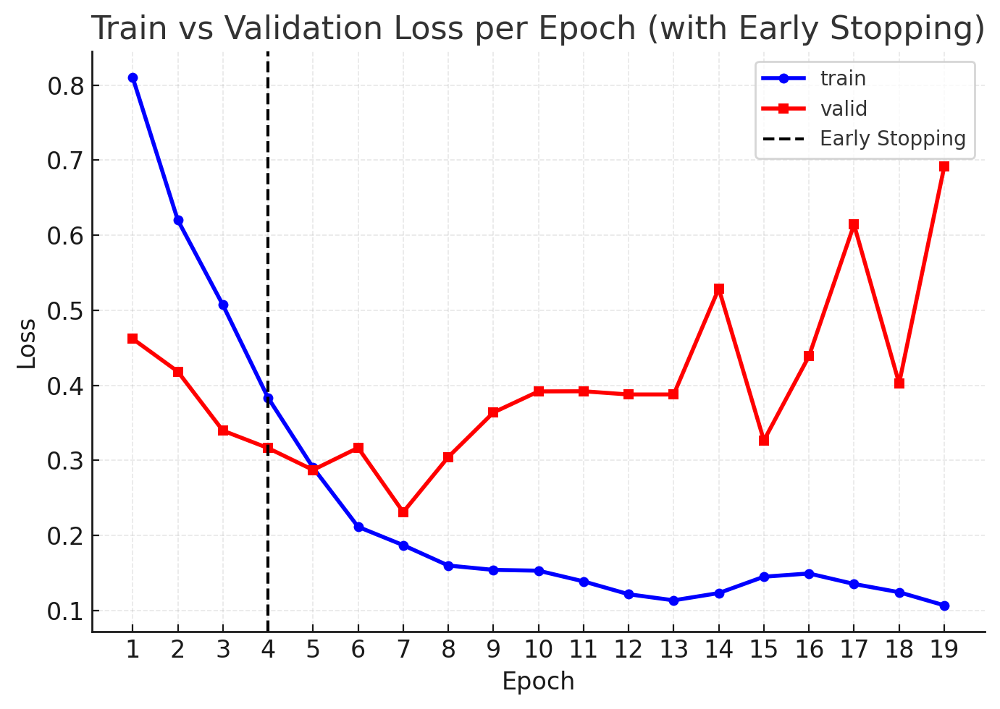
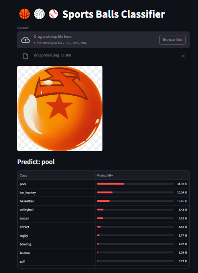

# 🏀 FastAI Balls Classifier

[](https://www.python.org/)
[](https://docs.fast.ai/)
[](https://pytorch.org/)

A simple multiclass image classifier built with FastAI + PyTorch to identify different types of sports balls (soccer, basketball, tennis, baseball, etc.) from images.

---

## Objective
Build a Computer Vision model that classifies images across multiple sports categories. The full pipeline includes:
- Automatic class folder creation  
- Train/validation data split  
- Model fine-tuning  
- Performance reports (confusion matrix, top losses)

---

## Project Structure

```bash
fastai-balls-classifier/
├── data/              # raw and processed images
├── notebooks/         # experiments and prototyping
├── src/               # training and utils scripts
├── models/            # saved and exported models
├── reports/           # plots and metrics
├── app.py             # Streamlit demo
└── requirements.txt
```

You can setup by running:
```bash
pip install -r requirements.txt
```


## Fitting ResNet34 pre-trained model
```bash
python src/train.py
```
- Builds FastAI DataLoaders
- Trains the head layer (frozen base)
- Unfreezes and fine-tunes the entire network
- Saves the best model automatically
- Generates reports and plots



**Note**: The validation loss becomes unstable after a few epochs, indicating overfitting due to the small dataset size and the model starting to memorize the training data.

## Results

| Metric     | Value  |
|------------|--------|
| Accuracy   | 92.8%  |
| Error Rate | 7.14%  |
|            |        |

### Confusion Matrix


## Predicting

You can predict from the command line:
```bash
python src/predict.py ./data/sample/dragonball.png
```
or launch the Streamlit app

```bash
streamlit run app.py
```




