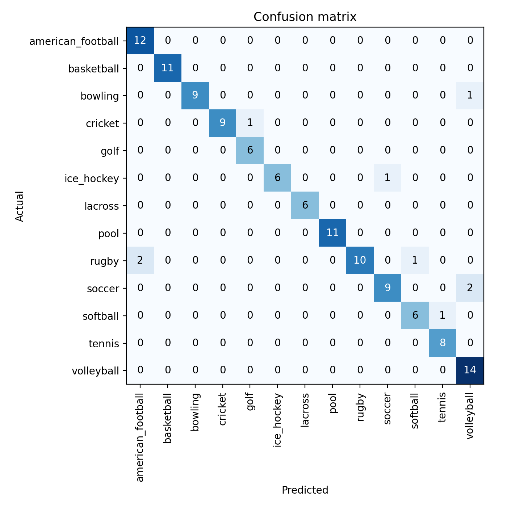

# 🏀 FastAI Balls Classifier

[](https://www.python.org/)
[](https://docs.fast.ai/)
[](https://pytorch.org/)

A simple multiclass image classifier built with FastAI + PyTorch to identify different types of sports balls (soccer, basketball, tennis, baseball, etc.) from images.

---

## Objective
Build a Computer Vision model that classifies images across multiple sports categories. The full pipeline includes:
- Automatic creation of class folders
- Train/validation split
- Training with a pretrained ResNet34
- Fine-tuning
- Result interpretation (confusion matrix and top losses)

---

## Project Structure
```
fastai-balls-classifier/
├── data/
│   ├── raw/
│   └── processed/
│
├── notebooks/
│   └── 01_experiments.ipynb   # tests and initial experiments
│
├── src/
│   ├── train.py               # final training + fine-tuning
│   ├── predict.py             # inference on new images
│   ├── prepare_split.py       # optional train/validation split
│   └── utils.py               # helper functions
│
├── models/
│   └── resnet34_export.pkl    # exported model
│
├── reports/
│   ├── confusion_matrix.png
│   ├── top_losses.png
│   └── lr_find.png
│
├── app/
│   └── app.py                 # Streamlit demo
│
├── README.md
├── requirements.txt
└── .gitignore
```

## Fitting ResNet34 pre-trained model
```bash
python src/train.py
```
- Building FastAI DataLoaders  
- Fitting the head layer (frozen base) to adapt the pretrained ResNet to the new classes
- Unfreezing the entire network and performing fine-tuning
- Automatically saving the best model weights
- Generating training reports

## Results

| Metric     | Value  |
|------------|--------|
| Accuracy   | 92.8%  |
| Error Rate | 7.14%  |
|            |        |

### Confusion Matrix



## 


